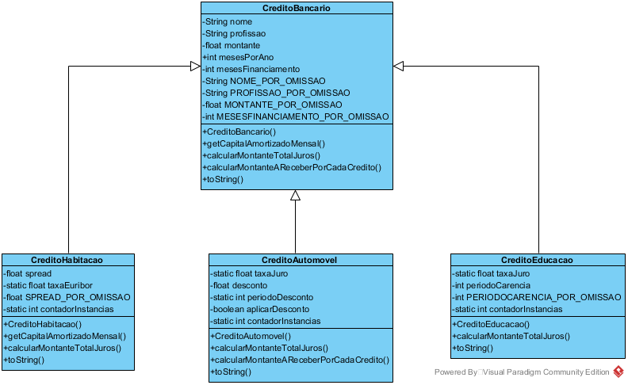
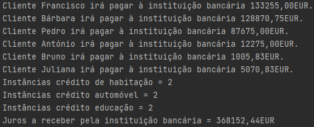
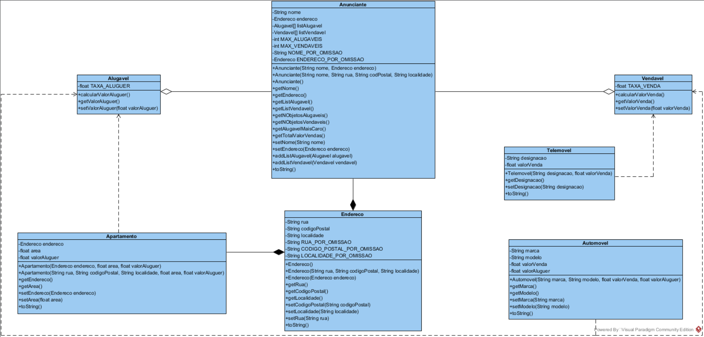
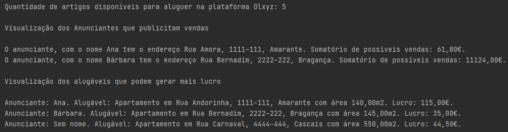

# Paradigmas da Programação / *Programming Paradigms* 🧐

## TP 1 - Bank Loans

***Goal:** Learn and apply concepts of inheritance between classes*

Simple Java application that simulates the following different types of bank loans, with different interest rates and duration periods:

- Education

- Housing

- Car Purchase

**Class diagram:**

**Program output:**

---

## TP 2 - C2C Sales Platform

***Goal:** Learn and apply concepts of interfaces*

Simple Java application that simulates an annoucement platform for sales or renting of goods (announcer side only). Goods are divided as:

- For sale

- For renting

**Class diagram:**

**Program output:**

---

## TP 3 - Freelancer Job Posting Platform - Final Project

***Goal:** Learn and apply concepts of graphical UI and serialization*

Simple Java application that simulates a platform for companies to post freelance job needs and for freelancers to view and apply for the jobs. Graphical user interface developed in JavaFX.

- [**Class DIAGRAM**](1dm_tp3_1181626_1191507_diagrama.pdf)

- [**Functionalities BRIEF**](1dm_tp3_1181626_1191507_relatorio.pdf)

*(images not available cuz  ¯\\\_(ツ)_/¯)*